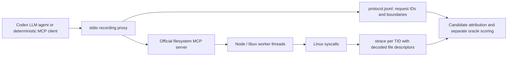

# MCP-to-syscall attribution experiment

## Question and scope

The research target is a causal relation from an **individual MCP tool invocation** to **one or more kernel effects**. A call can generate many syscalls; several calls can share threads, files, buffers, and processes. Therefore the target is not a one-to-one join on request ID and syscall.

The existing docs correctly focus on the missing boundary between logical tasks and Linux execution contexts. This experiment brings MCP integration forward from the original roadmap, while retaining the Rust/Tokio workload as a separate control. Python orchestrates the experiment; the measured application is the official Node filesystem MCP server, unmodified.

## Run it

Requires Linux with working `ptrace`/`strace -ff -yy`, Node.js (tested with 24.20.0), npm, and Python **3.11+**. This host's `python3` is 3.6: use `python3.11` explicitly. Agent runs additionally need Codex CLI (tested with 0.160.1) and an existing `codex login` session. They consume model usage. No API key is needed when using that login.

From the repo root:

```bash
npm ci --prefix experiments/mcp
python3.11 -m unittest discover -s experiments/mcp -v

# Real LLM chooses and executes MCP calls, including writing and reading a summary.
python3.11 experiments/mcp/run.py --mode agent

# Repeatable protocol controls against the very same real MCP server.
python3.11 experiments/mcp/run.py --mode replay --concurrency 1
python3.11 experiments/mcp/run.py --mode replay --concurrency 8
python3.11 experiments/mcp/run.py --mode replay --concurrency 8 --shared
```

Each command prints a new `results/mcp/<timestamp>-...` directory. `--output PATH` selects a new directory explicitly; existing directories are rejected so evidence is not overwritten. `--model NAME` optionally selects the agent model; otherwise the CLI resolves its default. `--concurrency` controls replay batches, not agent behavior. Four batches run per replay, with distinct paths unless `--shared` is selected. The deterministic client is not an LLM and its measurements are reported separately.

The agent gets an isolated working directory and run-local MCP configuration through command-line options. The harness does not edit global Codex configuration. It uses a read-only shell sandbox, and explicitly approves the filesystem server's `write_file` tool for the authorized fixture experiment. The MCP server's directory allowlist is application-level confinement, not an OS security boundary. The prompt requires all file operations to use MCP; the agent transcript remains available to audit adherence.

## Data flow



Only the MCP server and its descendants are traced. Fixture creation and the proxy's logging writes are outside the trace. Node startup, module loading, IPC, and runtime activity remain in the raw traces. The default syscall filter is %file,%process,%desc,%network; pass --capture strace-all to capture every syscall class. Both captures use per-thread strace -ff -yy output.

| Artifact | Meaning |
| --- | --- |
| `manifest.json` | Runtime versions, requested model override, mode, concurrency, completion status |
| `prompt.txt`, `agent.jsonl`, `agent.stderr` | Exact task and real agent transcript/errors (agent mode) |
| `protocol.jsonl` | Bidirectional JSON-RPC messages; epoch and monotonic nanoseconds at the proxy |
| `trace-command.json`, `server.stderr` | Exact tracing invocation and server diagnostics |
| `traces/strace.<tid>` | Raw syscall observations, including decoded FD targets |
| `kernel-events.jsonl` | Parsed events with PID/TID and source trace line |
| `tool-calls.jsonl` | Tool arguments and observed request/response intervals |
| `attribution.jsonl` | Fixture events, candidate request sets, and separate optional oracle labels |
| `report.json` | Counts, ambiguity, oracle coverage, parser accounting |
| `timeline.csv` | Selected syscall timeline with candidate IDs, oracle labels, and raw-source references |
| `sandbox/` | Synthetic input fixtures and agent output |

The protocol log includes tool arguments and returned fixture contents. Captures and installed packages are ignored by Git; the dependency lockfile is tracked. These are local experimental artifacts, not a telemetry upload.

## What the measurements mean

**PID baseline:** every tool call in this session is a candidate for every selected event in the server process. This is deliberately set-valued: selecting an arbitrary request would hide uncertainty.

**Request-window baseline:** candidates are calls whose proxy-observed request/response interval includes syscall entry time, in the server process. This uses observable boundary metadata, not oracle labels. A singleton is a correlation, not a causal guarantee. Proxy buffering can broaden intervals. Wall-clock adjustments and `strace` scheduling overhead are additional limitations; monotonic proxy times are retained for diagnosis, but kernel trace timestamps are epoch times.

**TID:** the stdio boundary does not expose a server execution TID. We report observed worker threads without inventing a request-to-thread mapping. That mapping is itself part of the missing mechanism.

**Oracle:** a path used by exactly one tool request can label direct path/FD operations for this restricted workload. The oracle is applied only after candidate generation. Shared or reused paths are deliberately unlabelled. It is not authoritative ground truth for arbitrary applications, caching, malicious servers, directory traversals, or unrelated background access. In particular, writing and then reading the same summary file does not give unique path labels. Precision/recall over all syscalls would be unjustified, so the report gives candidate ambiguity and correct/wrong singletons on the labelled subset instead.

The parser reassembles unfinished/resumed calls within each TID, reconstructs thread groups from `CLONE_THREAD`, retains source lines, and records unparsed/incomplete input. A pending syscall followed by an explicit tracee termination is counted separately as `terminal_interrupted`; it is not mistaken for a truncated trace file. It uses FD annotations for read/write targets, never file-looking text inside payload buffers. Its supported path syntax is intentionally conservative: escaped/truncated paths, relative path resolution, unusual syscalls, shared-memory operations, mmap effects, and io_uring completions need further work. PID reuse and exec from a nonleader thread are outside these short-lived runs. Do not treat the normalized file as a lossless trace; keep the raw data.

The standalone live descriptor-sharing probe can be reproduced with:

```bash
gcc -Wall -Wextra -O2 experiments/mcp/clone_files_probe.c -o /tmp/clone_files_probe
strace -ff -ttt -yy -s 128 -e trace=clone3,socket,fcntl,close,pipe,read,write,wait4 \
  -o /tmp/clone-files-trace /tmp/clone_files_probe
```

It verifies that `clone3(CLONE_FILES)` lets the parent observe a UDP socket opened
by the child. This validates the kernel and strace behavior used by the lifecycle
model; attribution behavior is additionally covered by synthetic trace tests.

## Existing repo issues affecting interpretation

These are observations about this repository, not changes to the Rust experiment:

1. TimeWindowStrategy::load_ground_truth loads per-event ground-truth request identities and timestamps for inference. This differs from README's stated isolation of ground truth. The evaluator now labels those CSV strategies oracle_assisted_*; the scores remain diagnostic, not attribution from kernel observations alone.
2. The Rust collector queries `/proc/<tid>/status` after execution, when threads may no longer exist. Its `--data-dir` workaround supplies one workload PID for all events; this cannot correctly represent arbitrary subprocess descendants.
3. The README quick start now captures ground truth and syscalls in the same workload execution. The smoke script also uses one execution and propagates workload failures.
4. The collector's generic comma splitting and syscall regex are insufficient for general MCP traces, decoded FDs, and unfinished/resumed records.

The MCP pipeline has its own schema and analyzer. The legacy evaluator remains separate and now labels its oracle-assisted strategy exports.

## Implemented bridge and remaining work

The bridge now propagates identity from **dispatch → async work submission → worker execution → syscall** for tested Node/libuv and Rust/Tokio cases. It restores nested scopes, records joins, observes one-shot child inheritance, and follows exclusive TCP connection ownership. The measured results, reproduction commands, and precise boundaries are in the runtime findings document.

Further work must cover multiplexed network protocols, long-lived child servers, more runtimes, lower-overhead syscall capture, and unprivileged/privileged eBPF collectors. No eBPF implementation ran on this host. The bridges trust runtime/application instrumentation and do not prove data-flow lineage. A security deployment would also need adversarial tests for forged or omitted records.

No CamFlow, SPADE, Tetragon, Tracee, Audit, or OpenTelemetry deployment was benchmarked here. The experiment establishes failures of the tested metadata baselines; it does not establish that every configuration of those systems fails. [CamFlow](https://camflow.org/) captures whole-system provenance and supports application integration; [OpenTelemetry context propagation](https://opentelemetry.io/docs/concepts/context-propagation/) preserves execution context across instrumented boundaries. The research question is the additional binding from logical request context to individual kernel effects under shared execution, which must be tested rather than inferred from product categories.

Implementation references: [official filesystem server](https://raw.githubusercontent.com/modelcontextprotocol/servers/main/src/filesystem/README.md), [Codex noninteractive mode](https://learn.chatgpt.com/docs/non-interactive-mode), [Codex MCP configuration](https://learn.chatgpt.com/docs/extend/mcp?surface=cli), and [per-tool approval settings](https://learn.chatgpt.com/docs/config-file/config-reference).
